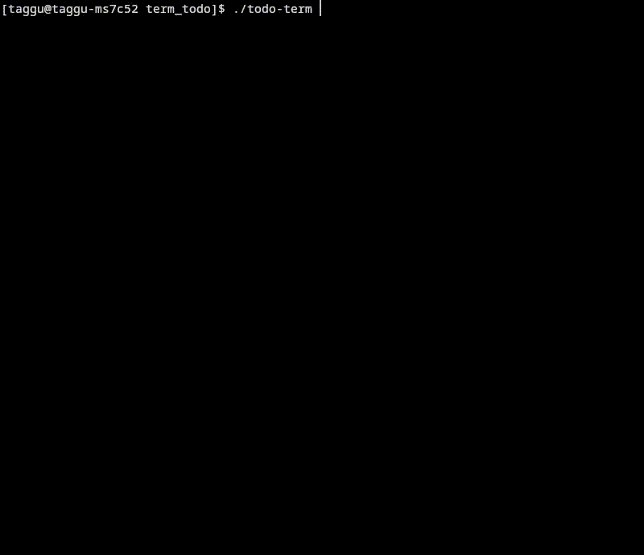

# Todo-term
This is a todo application in terminal that I made to practise using go

## Features
    - Creating new to-dos
    - saving to-do to a json file
    - checking to-dos

### This is how it looks currently

